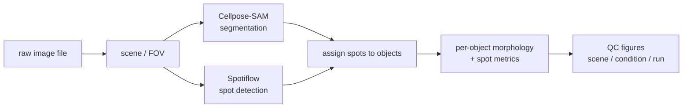

# spot-detector


<!-- TODO: add a license badge once a LICENSE file is chosen -->

Cellpose-SAM + Spotiflow pipeline for segmenting cell-like structures ("BAGs") and quantifying diffraction-limited
spot density inside them, from multi-format microscopy image data.

## Table of Contents

- [Overview](#overview)
- [Key Features](#key-features)
- [Example Output](#example-output)
- [Technology Stack](#technology-stack)
- [Installation](#installation)
- [Usage](#usage)
- [Pipeline Workflow and Architecture](#pipeline-workflow-and-architecture)
- [Testing and Development](#testing-and-development)

## Overview

Given a multi-channel microscopy image (or a folder of them), the pipeline segments a structural channel into individual
objects with Cellpose-SAM, detects diffraction-limited spots in a second channel with Spotiflow, assigns each spot
to the object it falls inside, and measures per-object morphology and spot counts/density. It runs in two modes,
selected by a single config flag: 2D (a single z-projection per field of view) or 3D (per-plane segmentation
stitched across a z-stack). Everything downstream of that flag — segmentation, measurement, QC figures — adapts
to the chosen mode from the same codebase.



## Key Features

- **Config-driven 2D/3D switch** — a single `mode.do_3d` flag changes segmentation strategy (stdev-projection vs.
  per-plane + z-stitching) and measurement columns, without branching the calling code.
- **Automatic model fallback** — if a configured Spotiflow model fails to load, or its dimensionality doesn't match
  the pipeline's 2D/3D mode, the pipeline falls back to a matching pretrained model rather than erroring out.
- **GPU-aware, resolution-adaptive segmentation** — images are downscaled by a configurable bin factor before
  Cellpose inference and masks are upscaled back, with edge-touching objects stripped automatically.
- **Three-tier QC figure generation** — per-scene, per-condition, and per-run summary figures are produced
  automatically, so segmentation/detection quality can be audited at every level of aggregation without re-running
  anything.
- **Batch fan-out over files and scenes** — a run walks every file in a raw data directory and every scene/FOV
  within multi-scene files, concatenating results into per-condition and whole-run tables.
- **Config-only pipeline parameters** — channel indices, model paths, binning, and detection thresholds are all
  externalized to YAML; no hardcoded paths or magic numbers in the processing code.
- **Offline, mocked test suite** — tests exercise the pipeline logic without loading real Cellpose/Spotiflow models
  or microscopy files, keeping the suite fast and independent of GPU/model availability.

## Example Output

<!-- TODO: *.png is currently gitignored repo-wide; carve out an exception (e.g. an assets/ or docs/ folder) and
     commit 1-2 representative QC figures from output/figures/ here, each with a one-sentence caption describing
     what the panel shows (e.g. segmentation mask overlay + assigned spots for one scene). -->

## Technology Stack

| Task | Tool |
|---|---|
| Object segmentation | [Cellpose-SAM](https://github.com/MouseLand/cellpose) |
| Spot detection | [Spotiflow](https://github.com/weigertlab/spotiflow) |
| Image IO (`.nd2`, `.czi`, `.lif`, OME-TIFF) | [bioio](https://github.com/bioio-devs/bioio) |
| Per-object measurement | scikit-image (`regionprops_table`) |
| Data handling | pandas, numpy |
| QC figures | matplotlib, seaborn |
| Environment / dependency management | [uv](https://github.com/astral-sh/uv) |
| Testing | pytest, pytest-mock |
| Linting / formatting | ruff, pre-commit |

GPU use is optional and controlled per-run via `segmentation.use_gpu` in the config; the pipeline runs on CPU with
no code changes if no GPU is available.

## Installation

```bash
GITHUB_REPO="https://github.com/MisokralPanovic/nikon_cellpose_bags_spots.git"
git clone "$GITHUB_REPO"
cd nikon_cellpose_bags_spots
uv sync
```

Requires Python 3.12+. `uv sync` resolves and installs all dependencies, including a CUDA-enabled PyTorch build
for GPU-accelerated segmentation (see `[tool.uv.sources]` in `pyproject.toml`).

## Usage

```bash
uv run spot-detector configs/config.yml
```

A run processes every image file under `paths.raw_data_dir`, writing per-condition and whole-run object tables to
`paths.out_dir/tables/` and matching QC figures to `paths.out_dir/figures/`. Everything that varies between runs —
2D vs. 3D mode, channel assignment, model paths, binning factor, detection thresholds — lives in the config file:

```yaml
mode:
  do_3d: false

paths:
  raw_data_dir: "data"
  out_dir: "output"
  cellpose_models_path: "../_pipeline_assets/cellpose_models/<model_name>"
  spotiflow_models_path: "../_pipeline_assets/<model_name>"

channels:
  segmentation_image: 0
  spot_image: 1

segmentation:
  use_gpu: true
  bin_factor: 4
  stitch_threshold: 0.4

detection:
  prob_thresh: 0.3
  min_distance: 1
```

## Pipeline Workflow and Architecture

A run fans out over files, then scenes, then processing stages:

```
run_pipeline (one call)
  -> one file at a time, for every file in raw_data_dir
       -> one scene/FOV at a time, for every scene in that file
            1. segment the structural channel (Cellpose-SAM)
            2. detect spots in the spot channel (Spotiflow)
            3. assign each spot to the object it falls inside (nearest-voxel lookup)
            4. measure per-object morphology and spot counts/density (regionprops)
            5. render a per-scene QC figure
       -> concatenate scene results, write a per-condition object table,
          render a per-condition summary figure
  -> concatenate all file results, write a whole-run object table,
     render a whole-run summary figure
```

2D and 3D mode share this same structure end-to-end: the mode flag changes how segmentation is performed
(projection + 2D Cellpose vs. per-plane 3D Cellpose with z-stitching) and which measurement columns are populated,
but not the shape of the pipeline itself.

## Testing and Development

```bash
uv run pytest
```

Tests mock the Cellpose/Spotiflow model calls rather than loading real models or microscopy files, so the suite
runs fast and offline. Code style is enforced with ruff and pre-commit hooks.
